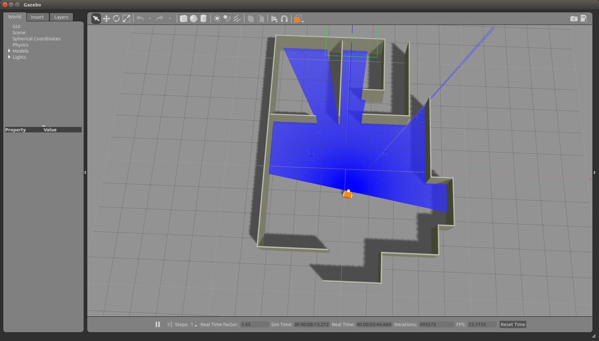

# Tutorial for ROS and Gazebo
This is the code basis for ROS and Gazebo Tutorials and Assignments. We use a simulated differential drive robot equipped with
* IMU
* Odometer
* LiDAR
* Camera

## Requirements
* ROS Kinetic (Ubuntu 16.04) or Melodic (Ubuntu 18.04), Installation Instructions can be found [here](http://wiki.ros.org/kinetic/Installation/Ubuntu)
* Gazebo (recommended: Version 7.0), comes with the ROS full desktop version, otherwise Installation Instructions can be found [here](http://gazebosim.org/tutorials?tut=install_ubuntu&ver=7.0)
* (optional) ROS-QTC-Plugin for using QT Creator as IDE, Installation Instructions can be found [here](https://ros-qtc-plugin.readthedocs.io/en/latest/_source/Improve-ROS-Qt-Creator-Plugin-Developers-ONLY.html)

## Additional Required Packages (installation instructions are given for ROS Melodic)
* [gmapping](http://wiki.ros.org/gmapping)
```bash
sudo apt-get install ros-melodic-gmapping
```
* [teleop_twist_keyboard](http://wiki.ros.org/teleop_twist_keyboard)
```bash
sudo apt-get install ros-melodic-teleop-twist-keyboard
```
* [map_server](http://wiki.ros.org/map_server)
```bash
sudo apt-get install ros-melodic-map-server
```
* [amcl](http://wiki.ros.org/amcl)
```bash
sudo apt-get install ros-melodic-amcl
```

## How to:
* Start by creating a catkin workspace folder, downloading the git repository and compiling the code
```bash
mkdir -p ~/tutorial_ws/src
cd ~/tutorial_ws/src 
git clone https://github.com/NRottmann/ROS_Gazebo_Tutorial.git
cd  ..
catkin_make
```
* Start the simulation
```bash
cd ~/tutorial_ws
source devel/setup.bash
roslaunch simulation_environment apartment.launch
```
* The Gazebo environment should have opened and something similar to the image below should have appeared:


* Now you can move the robot around by opening a new terminal and typing
```bash
rosrun teleop_twist_keyboard teleop_twist_keyboard.py
```

## Important Topics (Message Types) provided by the Simulation Environment
* Published
  * /camera/image_raw 	(sensor_msgs/Image)
  * /imu		(sensor_msgs/Imu)
  * /odom		(nav_msgs/Odometry)
  * /scan		(sensor_msgs/LaserScan)
* Subsrcibed
  * /cmd_vel		(geoemtry_msgs/Twist)

## Assignment:
1. Generate a Map of the Environment
  * Start the simulation environment and gampping (hint: have a look into the mapping.launch file)
  * Drive the robot around using the teleop_twist_keyboard until you the map is sufficient accurate (hint: you can have a look onto the map by using rviz)
  ```bash
  rosrun teleop_twist_keyboard teleop_twist_keyboard.py
  ```
  * Save the map using map_server
  ```bash
  rosrun map_server map_saver -f myMapName
  ```

2. Find the Person in the Building (the robot will start at a random position outside the building)
  * Create a ROS Node which subscribes to the pose information from the amcl package (Particle Filter) and searches for the missing person by publishing to the /cmd_vel topic. The robot should stop if it found the missing person. For localization you can upload your generated map (example: localization.launch)
  * By running the person_detector (example: detection.launch), a new topic /person_detector will appear which publishes the message pal_person_detector_opencv/Detections2d. This message contains information about detected person in the camera image. For more information about the person detector, we refer to the [ros wiki](http://wiki.ros.org/Robots/TIAGo/Tutorials/PersonDetection). For simplicity, we included the required parts of the pal repository into our tutorial repository.


